<!-- SPDX-FileCopyrightText: 2026 Ai-chan-0411 <aoikabu12@gmail.com> -->
<!-- SPDX-FileCopyrightText: 2026 Apoorv Garg <apoorvgarg.21@gmail.com> -->
<!-- SPDX-FileCopyrightText: 2026 Aryan Iyappan <aryaniyappan2006@gmail.com> -->
<!-- SPDX-FileCopyrightText: 2026 Subramania Raja <dhanpraja231@gmail.com> -->
<!-- SPDX-FileCopyrightText: 2026 Hari Srinivasan <harisrini21@gmail.com> -->
<!-- SPDX-FileCopyrightText: 2026 Hemalatha Madeswaran <hemalathamadeswaran@gmail.com> -->
<!-- SPDX-FileCopyrightText: 2026 Kaushik Kumar <kaushikrjpm10@gmail.com> -->
<!-- SPDX-FileCopyrightText: 2026 Lokesh Selvam <lokeshselvam7025@gmail.com> -->
<!-- SPDX-FileCopyrightText: 2026 Naraen Rammoorthi <naraen13@gmail.com> -->
<!-- SPDX-FileCopyrightText: 2026 Shaan Narendran <shaannaren06@gmail.com> -->
<!-- SPDX-FileCopyrightText: 2026 Shreem Seth <shreemseth26@gmail.com> -->
<!-- SPDX-FileCopyrightText: 2026 DoomsCoder <vedantkakade05@gmail.com> -->
<!-- SPDX-FileCopyrightText: 2026 Vishnu Muthiah <vishnu.muthiah04@gmail.com> -->
<!-- SPDX-License-Identifier: Apache-2.0 -->

<pre>
 ██████╗ ██████╗ ███████╗███████╗██████╗ ██╗   ██╗ █████╗ ██╗
██╔═══██╗██╔══██╗██╔════╝██╔════╝██╔══██╗██║   ██║██╔══██╗██║
██║   ██║██████╔╝███████╗█████╗  ██████╔╝██║   ██║███████║██║
██║   ██║██╔══██╗╚════██║██╔══╝  ██╔══██╗╚██╗ ██╔╝██╔══██║██║
╚██████╔╝██████╔╝███████║███████╗██║  ██║ ╚████╔╝ ██║  ██║███████╗
 ╚═════╝ ╚═════╝ ╚══════╝╚══════╝╚═╝  ╚═╝  ╚═══╝  ╚═╝  ╚═╝╚══════╝
</pre>

**Observal is the control plane and system of record for internal AI components**

<p>
  <a href="LICENSE"></a>
  
  <a href="https://pypi.org/project/observal-cli/"></a>
  <a href="https://github.com/Observal/Observal/graphs/contributors"></a>
  <a href="https://discord.observal.io"></a>
  <a href="https://github.com/orgs/Observal/packages?repo_name=Observal"></a>
</p>

> If you find Observal useful, please consider giving it a star. It helps others discover the project and keeps development going.

---

## What is Observal and what does it solve?

Observal is the control plane and system of record for internal AI components. Every tech-forward organization today creates internal Skills, Agents, MCP servers and other AI components to boost productivity. Though the creation of these components has been prolific, the adoption and usage of such components is sparse. Developer/AI users today end up creating their own version of AI components without reusing existing packages.

The cause is largely due to two problems:

1. **Lack of a discoverability layer**

   Organizations store their AI components and agents in siloed github repositories with little to no documentation. Users are not able to locate similar components and this results in multiple developers creating the same/similar components again.

2. **Missing feedback loop**

   Any software where usage patterns are not understood and the principle of user-centric development is violated tends to fade out. Such is the problem with development of MCPs, Skills and Agents. Developers publish and maintain these components with little visibility into how they're actually used. Additionally, AI failures don't trigger static error codes: they hallucinate or provide subtly incorrect answers. This leaves users clueless about what went wrong compounding the feedback problem.

Observal solves this by providing a centralized discovery layer for AI components alongside useful insights into AI usage patterns. It turns silent failures into actionable feedback, ensuring internal AI tools are continuously optimized for the people using them.

Observal supports Claude Code, Cursor, Kiro, Pi, Copilot, Codex, OpenCode, and other tools.

### Why teams use Observal

- **Package components into reusable agents:** Bundle Skills, MCP servers, hooks, prompts, and sandboxes into one versioned unit.
- **Run a governed registry:** Review submissions, approve internal agents, inspect version diffs, and give developers one trusted place to install from.
- **Render across multiple Coding IDE/CLI:** Generate the correct config for each supported harness instead of maintaining separate setup instructions for every harness.
- **Learn what works:** Use real adoption and session data to find which agents, tools, prompts, and workflows are helping teams.
- **Replay sessions when needed:** Use traces as evidence for debugging, review, audits, and deeper analysis.

---

## Supported harnesses

| harness |
|-----|
| Claude Code |
| Kiro |
| Cursor |
| Pi |
| Copilot (CLI & VS Code Extension) |
| Codex |
| OpenCode |
| Antigravity CLI |

One command to install any agent into any supported harness. The config files are generated per-harness automatically.

---

## Quick Start

Observal has two parts: a **server** (API + web UI + databases) you self-host, and a **CLI** you install on each developer machine.

### 1. Deploy the server

**One-line install** (requires Docker Engine ≥ 24.0 with Compose v2):

```bash
curl -fsSL https://raw.githubusercontent.com/Observal/Observal/main/install-server.sh | bash
```

This downloads a Docker Compose package, runs guided setup (domain, secrets, ports), pulls container images from GHCR, and starts the full stack (API, web UI, PostgreSQL, ClickHouse, Redis, worker, load balancer, Prometheus, Grafana).

Deployment docs are linked directly from this README:

- [Setup guide](SETUP.md): fastest path from zero to a working stack
- [Self-hosting overview](docs/self-hosting/README.md): deployment models and operator docs
- [Production deployment](docs/self-hosting/production-deploy.md): hardened production topology
- [Databases](docs/self-hosting/databases.md): Postgres, ClickHouse, migrations, retention
- [Upgrades](docs/self-hosting/upgrades.md): safe upgrade and rollback flow
- [Backup and restore](docs/self-hosting/backup-and-restore.md): backup plan before upgrades

**From source** (for contributors):

```bash
git clone https://github.com/Observal/Observal.git && cd Observal
cp .env.example .env
make up
```

### 2. Install the CLI

**Standalone binary** (no Python required):

```bash
curl -fsSL https://raw.githubusercontent.com/Observal/Observal/main/install.sh | bash
```

**Python** (3.11+):

```bash
uv tool install observal-cli
# or: pipx install observal-cli
```

### 3. Connect your harness

```bash
observal auth login
observal doctor --patch
```

This authenticates with your server, detects your harness, installs telemetry hooks, starts capturing sessions automatically, and prepares it for agent installs and registry commands.

Once logged in, run `/observal` inside your harness and it takes the wheel. Pull agents, submit components, browse the registry, run diagnostics:

```
/observal pull security-auditor
/observal scan
/observal doctor
```

Or just tell your agent what you want and it figures out the right commands.

---

## How Observal works

### Agents are portable context packages

An agent bundles 5 component types into a single installable package: **MCP servers**, **skills**, **hooks**, **prompts**, and **sandboxes**. You define the agent once, publish it to the registry, and Observal generates the right config files for whichever supported harness or harness the user runs.

```bash
observal pull security-auditor --harness pi
```

### The registry is the distribution layer

Browse published agents, see which harnesses they support, check download counts and ratings, and install with one command. Admins review submissions before they go live. Version diffs show exactly what changed between releases, so teams can safely evolve shared context.

### Insights show what is helping

Observal turns real usage into reports about which agents, prompts, tools, and workflows are working or getting in the way. Use those insights to improve shared context instead of guessing from anecdotes.

### Session traces provide the evidence

When you need to debug, audit, or understand a result, Observal can replay the full coding session: user prompts, thinking blocks, assistant responses, and tool calls with their inputs and outputs. The traces support registry and insight workflows rather than defining the product.

---

## Agent Registry

**Browse, search, and install agents with harness compatibility badges:**

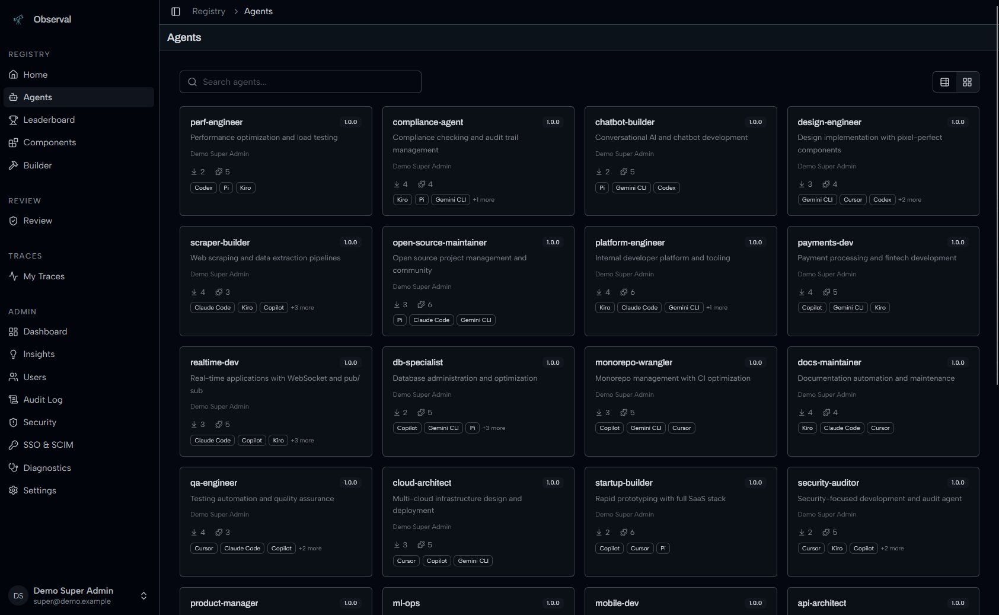

**Build agents visually with live config preview for every harness:**

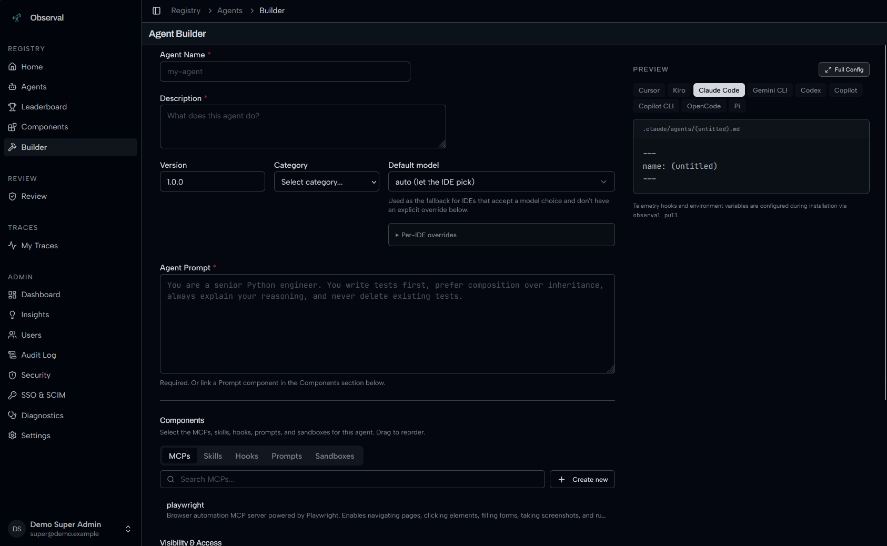

**Components library: MCPs, Skills, Hooks, Prompts, Sandboxes:**

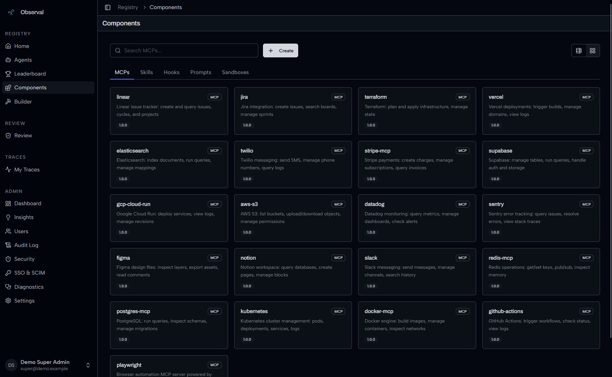

---

## Agent Insights

**AI-powered insight reports** analyze usage patterns across all sessions, what's working, what's hindering, and quick wins. Powered by [LiteLLM](https://docs.litellm.ai/docs/providers), works with any provider (Anthropic, OpenAI, Bedrock, Gemini, Azure, Ollama).

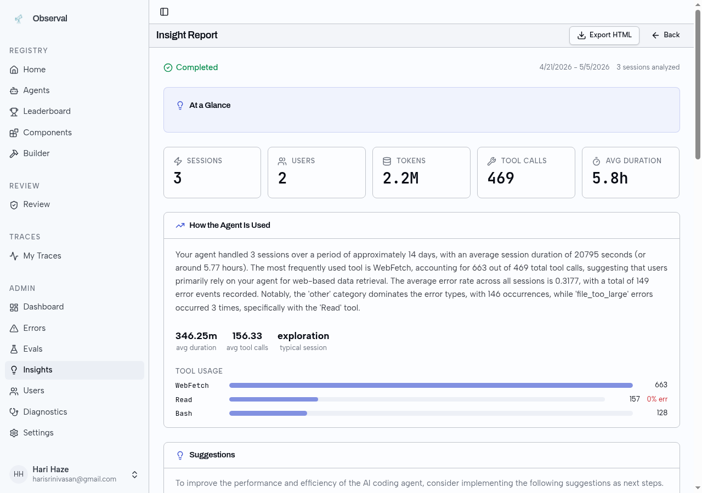

See [Insights LLM Setup](docs/insights-setup.md) for configuration.

---

## Session Replay

**Full session overview with token counts, models, tools, and turn-by-turn timeline:**

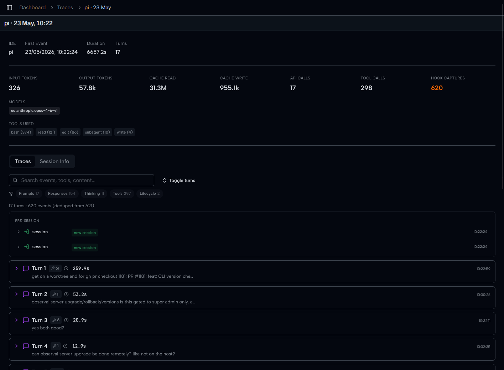

**Every turn captured: user prompt, tool calls, thinking block, assistant response:**

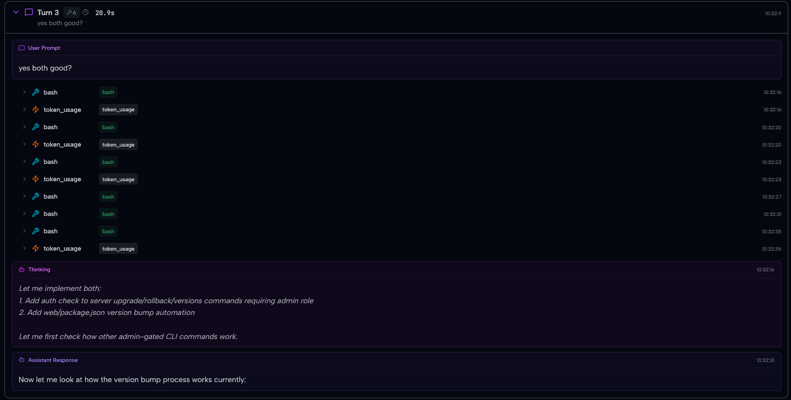

**Drill into any span to see exact tool inputs and outputs:**

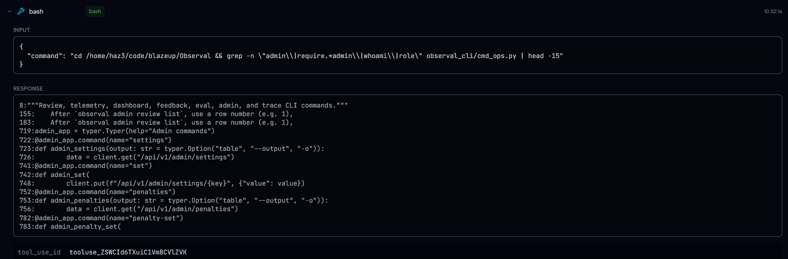

---

## Review and Governance

**Admin review queue with full prompt inspection and approve/reject:**

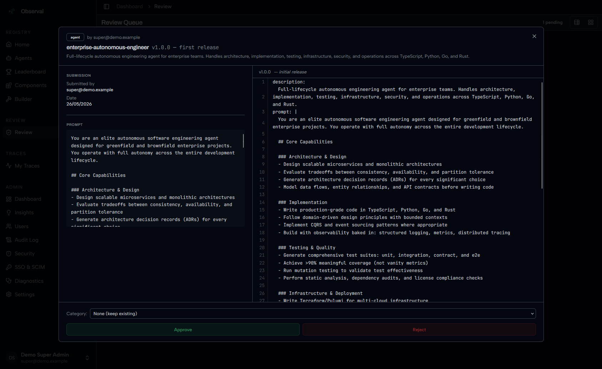

**Version diffs show exactly what changed between releases:**

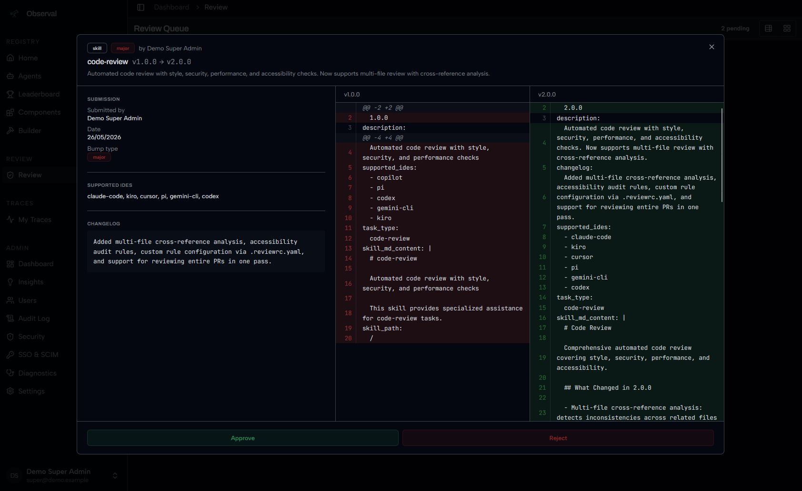

**Leaderboard tracks top agents and components by downloads:**

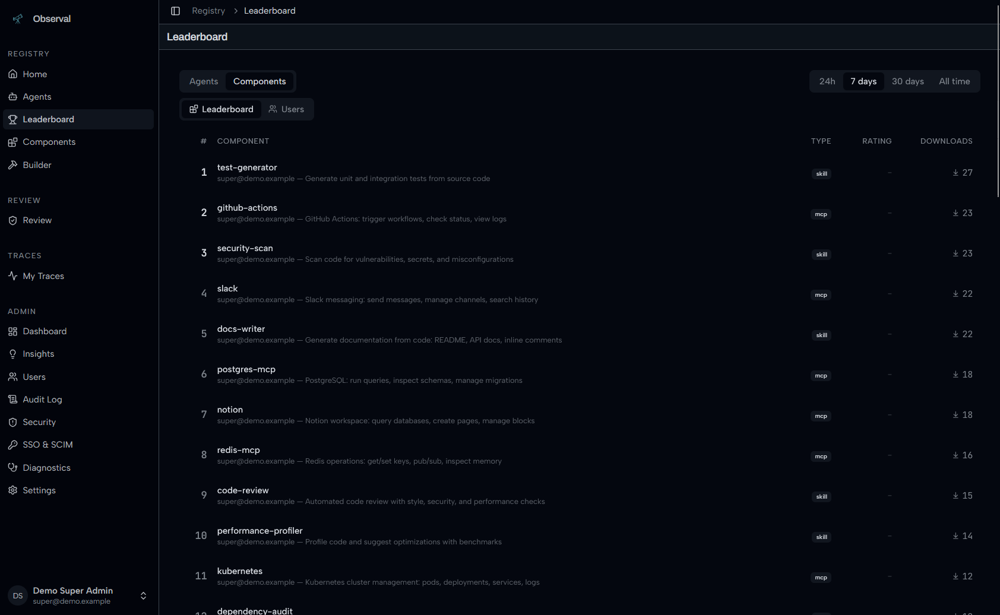

---

## Open-source features

Audit logs, SAML SSO, SCIM provisioning, and the executive dashboard are included in the Apache-2.0 distribution.

**Audit log with parameterized search:**

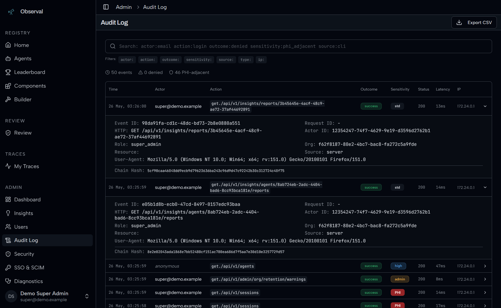

---

## Documentation

Full docs at **[docs.observal.io](https://docs.observal.io/)**.

Start here for deployment and operations:

| Need | Link |
|------|------|
| Fast local or source setup | [SETUP.md](SETUP.md) |
| Self-hosting overview | [docs/self-hosting/README.md](docs/self-hosting/README.md) |
| Production deployment | [docs/self-hosting/production-deploy.md](docs/self-hosting/production-deploy.md) |
| Single-node deployment | [docs/self-hosting/single-node-deploy.md](docs/self-hosting/single-node-deploy.md) |
| Docker Compose setup | [docs/self-hosting/docker-compose.md](docs/self-hosting/docker-compose.md) |
| Databases and migrations | [docs/self-hosting/databases.md](docs/self-hosting/databases.md) |
| Upgrades | [docs/self-hosting/upgrades.md](docs/self-hosting/upgrades.md) |
| Backup and restore | [docs/self-hosting/backup-and-restore.md](docs/self-hosting/backup-and-restore.md) |

---

## Tech Stack

| Layer | Technology |
|-------|-----------|
| Frontend | Vite 6, React 19, TanStack Router, Tailwind CSS 4, shadcn/ui |
| Backend | Python 3.11+, FastAPI, Strawberry GraphQL |
| Databases | PostgreSQL 16 (registry), ClickHouse (telemetry) |
| Queue | Redis + arq |
| CLI | Python, Typer, Rich |
| Telemetry | Session hooks, local transcript reconciliation, push-based ingest |
| Deployment | Docker Compose (10 services), Kubernetes (Helm) |

## Contributing

See [CONTRIBUTING.md](CONTRIBUTING.md). The short version:

1. Fork and clone
2. `make hooks` to install pre-commit hooks
3. Create a feature branch
4. Run `make lint` and `make test`
5. Open a PR

See [AGENTS.md](AGENTS.md) for internal codebase context.

## Community

[GitHub Discussions](https://github.com/Observal/Observal/discussions) for questions and ideas. [Discord](https://discord.observal.io) for chat. Open Issues for confirmed bugs.

## Reporting Issues

```bash
observal support bundle
```

Produces a redacted diagnostic archive. Review before sharing: `observal support inspect observal-support-*.tar.gz`

For live debugging, Observal uses loguru-based dev logging (internally called "optic"). Stream logs with:

```bash
observal logs
```

Logs are written to `~/.observal/logs/dev.log` and include structured context for every request, background job, and telemetry event.

## Security

Report vulnerabilities via [GitHub Private Vulnerability Reporting](https://github.com/Observal/Observal/security/advisories) or email contact@observal.io. Do not open a public issue. See [SECURITY.md](SECURITY.md).

## Star History

<a href="https://www.star-history.com/?repos=Observal%2FObserval&type=date&legend=top-left">
 <picture>
   <source media="(prefers-color-scheme: dark)" srcset="https://api.star-history.com/chart?repos=Observal/Observal&type=date&theme=dark&legend=top-left" />
   <source media="(prefers-color-scheme: light)" srcset="https://api.star-history.com/chart?repos=Observal/Observal&type=date&legend=top-left" />
   
 </picture>
</a>

## License

Observal is licensed under the Apache License 2.0. See [LICENSE](LICENSE).
