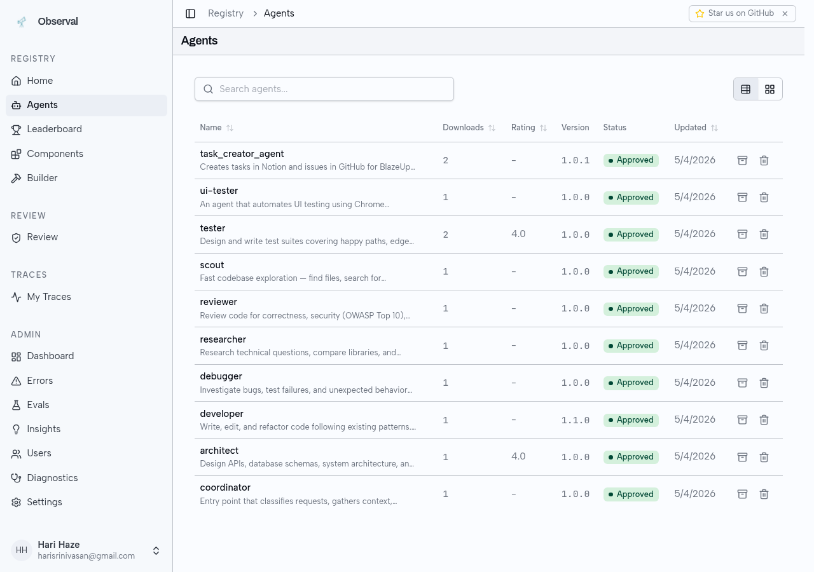
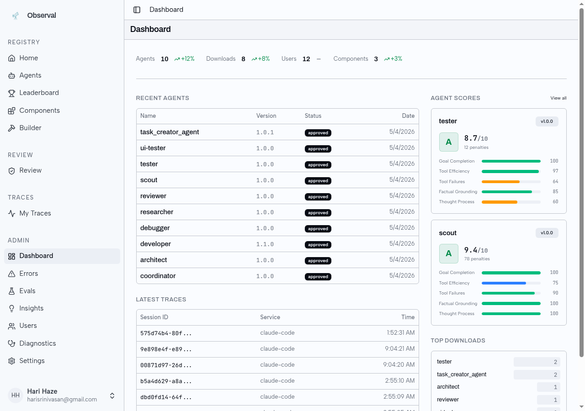
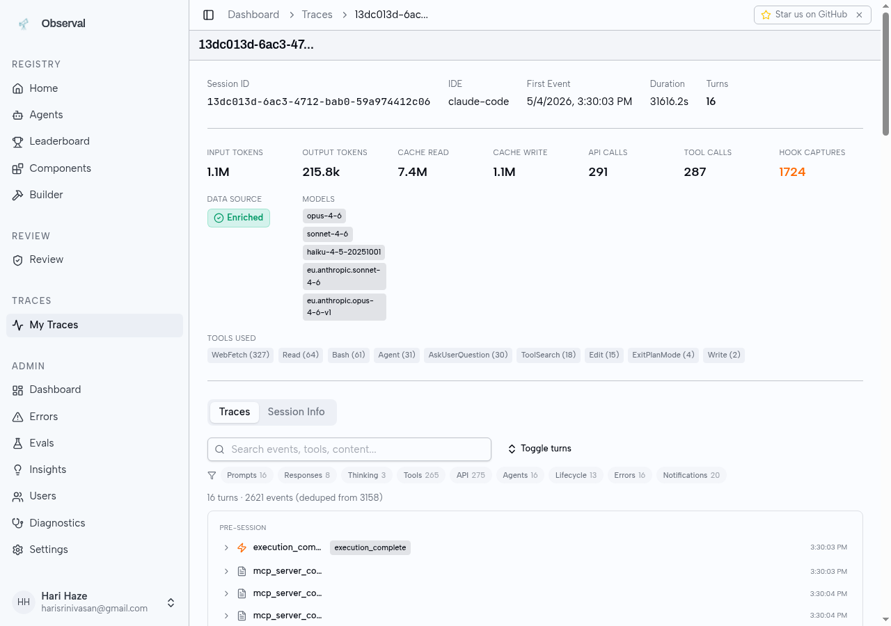
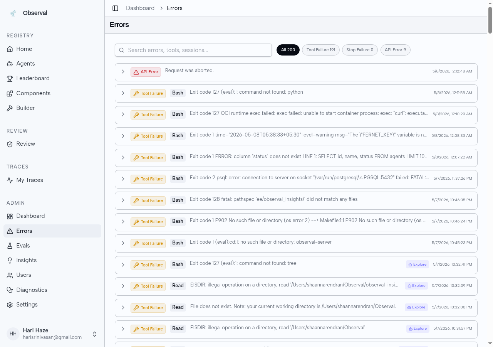

# Welcome to Observal

Observal is a **self-hosted AI agent registry with built-in observability**. Think Docker Hub, but for AI coding agents.

It gives you three things the AI-agent ecosystem doesn't:

1. **A registry** — browse, publish, and install complete agent configurations. Each agent bundles its MCP servers, skills, hooks, prompts, and sandboxes into one portable YAML that installs cleanly into Claude Code, Kiro, Cursor, Gemini CLI, and more.
2. **A telemetry pipeline** — a transparent shim sits between your IDE and every MCP server. Every tool call becomes a span, spans group into traces, traces form sessions. Everything streams into ClickHouse with zero changes to the MCP servers themselves.
3. **An evaluation engine** — scores agent sessions on goal completion, tool efficiency, factual grounding, thought process, and adversarial robustness. Compare agent versions. See what actually works.

## Who this is for

- **AI engineers** who want to know which of their agents actually deliver results, not just look impressive in a demo.
- **Platform teams** running agents across a team or org who need visibility, governance, and a single source of truth.
- **Agent authors** who want to share their work and see how it performs on real workflows.
- **Operators** who want the entire stack self-hosted: Docker Compose up, no SaaS, no egress.

## Start here

| If you want to...                                     | Go to                                                   |
| ----------------------------------------------------- | ------------------------------------------------------- |
| Install the CLI and see your first trace in 5 minutes | [Quickstart](getting-started/quickstart.md)             |
| Understand traces, spans, agents, and components      | [Core Concepts](getting-started/core-concepts.md)       |
| Instrument the MCP servers you already use            | [Observe MCP traffic](use-cases/observe-mcp-traffic.md) |
| Run Observal on your own infrastructure               | [Self-Hosting](self-hosting/README.md)                  |
| Look up a specific CLI command                        | [CLI Reference](cli/README.md)                          |

## What it looks like

**Agent Registry** — browse, search, and install published agents

**Dashboard** — live agent scores, recent sessions, top downloads

**Trace Detail** — every tool call captured with models, token counts, and tool breakdown

**Insight Report** — AI-generated analysis of agent usage patterns

**Error Log** — classified errors with drill-through to the triggering session

**Review Queue** — admin approve/reject workflow for submitted components

## Supported IDEs

| IDE / Tool  | Support Level   | Features                                                              |
| ----------- | --------------- | --------------------------------------------------------------------- |
| Claude Code | Fully supported | Skills, hook bridge, MCP servers, rules, OTLP telemetry               |
| Kiro CLI    | Fully supported | Superpowers, hook bridge, MCP servers, steering files, OTLP telemetry |
| Gemini CLI  | Tested          | Hook bridge, MCP servers, rules, OTLP telemetry                       |
| Cursor      | Tested          | MCP servers, rules                                                    |
| VS Code     | Limited         | MCP servers, rules                                                    |
| Copilot CLI | Limited         | Hook bridge, MCP servers, rules                                       |
| Codex CLI   | Limited         | Rules                                                                 |
| OpenCode    | Limited         | Hook bridge (JS plugin), MCP servers, rules                           |

The full matrix lives in [Integrations](integrations/README.md).

## Is Observal free?

Yes. Observal is open source under the GNU AGPL v3.0 license. Self-host the whole thing for free. There is an enterprise edition with SSO, SCIM, and audit logging, but everything covered in these docs works without it.

## Next

→ [Installation](getting-started/installation.md)
