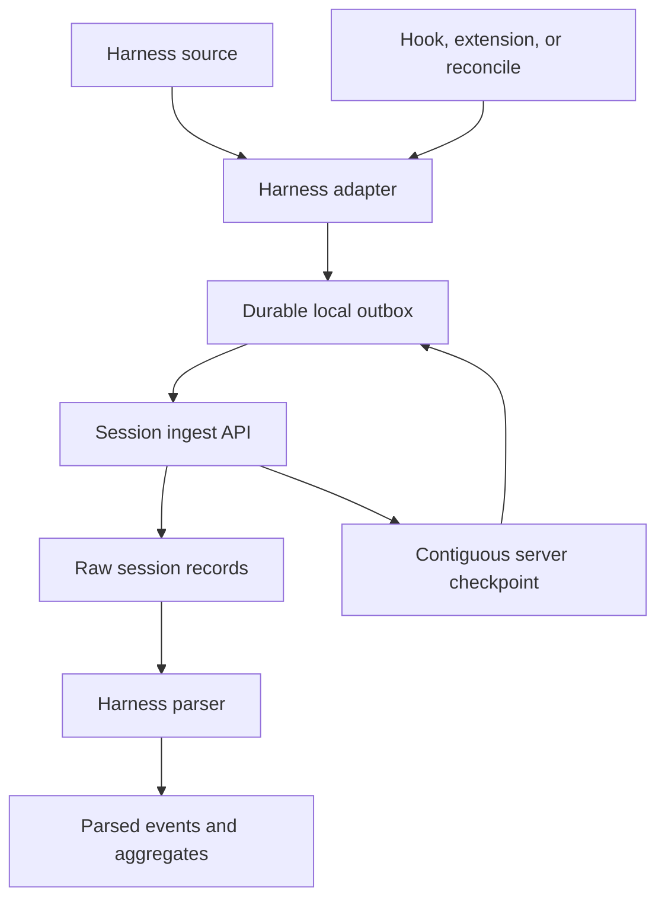

<!-- SPDX-FileCopyrightText: 2026 Hari Srinivasan <harisrini21@gmail.com> -->
<!-- SPDX-License-Identifier: Apache-2.0 -->

# Session tracking and reconciliation

Observal turns local harness conversations into indexed session events. This page explains the complete path from a harness source through durable delivery, server parsing, reconciliation, and recovery.

## Data model

### Session

A session is one harness conversation or task identified by `session_id`. Observal records the harness, authenticated user, project, agent attribution, and source position with each record.

### Source record

A source record is one complete item emitted by the harness. For a JSONL source, it is one non-empty, newline-terminated line. For a native source, the extension creates an equivalent stable record before delivery.

### Event

The server parser converts each source record into an event such as a user prompt, assistant response, tool call, tool result, token update, lifecycle hook, error, or subagent event. Available detail depends on the harness source.

### Aggregate

`session_stats_agg` summarizes event counts, prompts, tool calls, tool results, token totals, models, harnesses, agent attribution, and timing. Dashboards and insights query these aggregates.

## End-to-end flow



The normal pipeline has seven stages:

1. The harness writes a JSONL transcript or exposes messages through a native API.
2. A hook, extension event, or `observal reconcile` wakes the exporter.
3. The harness adapter discovers the source and reads only complete records after the current checkpoint.
4. The exporter writes the batch to a durable local outbox before attempting the network request.
5. The exporter posts the batch to `POST /api/v1/ingest/session`.
6. The server stores raw records, parses them, and returns the highest contiguous acknowledged source position.
7. The exporter removes acknowledged batches and advances its local cursor.

Hooks and reconciliation use the same source adapters and acknowledgement protocol. Reconciliation is a recovery path, not a separate ingestion system.

## JSONL sources

JSON Lines stores one JSON value per line. Observal treats a line as ready only after its terminating newline is present. An incomplete final line remains local until the harness finishes writing it. Blank lines are ignored.

The exporter retains three pieces of source position:

* the zero-based record index
* the absolute byte offset at the end of each record
* the local byte cursor used for the next read

Raw records are not normalized in the CLI. The server selects the parser registered for the harness, which keeps source discovery independent from event classification.

OpenCode and Pi use native extension APIs rather than reading another process's transcript. Their extensions convert messages to stable JSONL-compatible records and then follow the same indexed ingest contract.

## Discovery and wake-ups

Each harness adapter knows where that harness stores sessions and how to identify a stable session ID. Adapters may discover JSONL files, materialized hook records, or native message records.

Hooks and extensions wake delivery at supported lifecycle boundaries, including prompt submission, idle, stop, and agent completion. A wake-up is only a request to resume work. Delivery state lives in the durable outbox and checkpoints, so correctness does not depend on one hook process staying alive.

`observal agent pull` installs the appropriate session hooks or extension for the selected harness. `observal doctor` diagnoses missing instrumentation and can repair it with confirmation.

## Durable local delivery

Session delivery is eventual at-least-once delivery with effectively-once storage.

| Exporter | Durable pending data | Cursor or state |
| --- | --- | --- |
| Shared Python exporter | `~/.observal/telemetry_buffer.db` | `~/.observal/sync_state.json` |
| OpenCode extension | `~/.observal/opencode_session_outbox/` | Per-session state in the same directory |
| Pi extension | `~/.observal/pi_session_outbox/` | `~/.observal/sync_state.json` |

The exporters cap their outboxes at 256 MiB. Reaching the limit raises or logs an explicit error instead of evicting unacknowledged records.

A network timeout, process exit, or server outage leaves the pending batch intact. A later hook, extension event, or reconciliation run retries it. The shared exporter drains older pending records before sending newly discovered source records.

Pending data is bound to its destination server and authenticated user. It is not silently delivered to a different registry or account after a login change.

## Checkpoints and idempotency

The server identifies a source record by project, user, harness, session ID, and source index. Repeated or overlapping uploads therefore converge on the same record.

An acknowledgement contains:

* `acknowledged_line`, the highest contiguous source index stored by the server
* `acknowledged_offset`, the corresponding source byte offset

Only a contiguous acknowledgement advances the local cursor. If the server has indexes 0 and 2 but not 1, the checkpoint remains at 0. This prevents a later record from hiding a missing earlier record.

If local cursor state is missing, invalid, or stale, the exporter reads the authenticated checkpoint from `GET /api/v1/ingest/session/checkpoint`. It resumes from the server position when that position matches the local source. This avoids replaying all acknowledged history after local state loss.

If the content at an acknowledged source index changes, the server rejects the conflict rather than overwriting the canonical record.

## Finalization and integrity repair

Normal hook uploads hash only the records needed for the current batch. They do not repeatedly hash the complete session.

At finalization, the exporter makes a stable-file pass and sends the total record count, total byte offset, and SHA-256 session hash. The server compares that summary with stored records. If it finds a gap or mismatch, it returns `repair_from_line`. The exporter rewinds to that point and replays the affected range through the same idempotent path.

This repair handles interrupted uploads and stale cursors. It cannot recover a source record that the harness deleted before any installed hook or extension observed and durably spooled it.

## Server processing

The ingest endpoint validates batch size, line size, ordered byte offsets, finalization metadata, and authentication. It stores raw source records in ClickHouse `session_events` and classifies them with the registered harness parser.

Session records include agent ID, agent version, and layer hash when attribution is available. Claude Code subagent records can also include a parent session ID. Kiro can report total session credits as durable metadata.

After ingestion, session-level aggregates are available through `session_stats_agg`. PostgreSQL remains responsible for relational registry, user, review, and configuration data. MCP commands and remote URLs remain direct; Observal does not proxy MCP transport traffic.

## Reconciliation

Run reconciliation when hooks were installed late, a machine was offline, delivery was interrupted, or you want to verify recent local history.

Preview the default seven-day scan without sending data:

```bash
observal reconcile --dry-run
```

Push recent sessions from every installed harness:

```bash
observal reconcile
```

Limit discovery to one harness or time window:

```bash
observal reconcile --harness kiro --since 24
```

`--since` is a number of hours and defaults to 168. Without `--harness`, the command scans every installed adapter. A non-dry run first retries the existing shared outbox, then discovers matching sources, recovers each server checkpoint, and sends only records after that checkpoint.

A dry run reports sessions whose local source is larger than the local cursor. It does not drain the outbox, contact the ingest endpoint, or change cursor state.

## Installation and verification

Check authentication and local delivery health:

```bash
observal auth status
observal ops telemetry status
```

Preview recoverable sessions, push them, and inspect recent traces:

```bash
observal reconcile --dry-run
observal reconcile
observal ops traces --limit 5
```

If instrumentation is missing, run Doctor and confirm the proposed repair:

```bash
observal doctor
```

## Troubleshooting

### Sessions are not discovered

Confirm that the harness is installed, its local session source exists, and the source was modified inside the `--since` window. Use `--harness` to isolate one adapter.

### Records remain pending

Run `observal ops telemetry status`, verify the configured server is reachable, and confirm the current login matches the user and destination associated with the pending records. The next exporter wake-up or `observal reconcile` retries them.

### A checkpoint does not match the local source

The command leaves the source untouched and reports the mismatch. Preserve both the source and `~/.observal/` state while investigating. A changed or truncated transcript can no longer prove the byte position previously acknowledged by the server.

### A record is permanently rejected

The shared exporter quarantines permanently rejected payloads in `~/.observal/telemetry_buffer.rejected.jsonl` so one invalid session does not block later sessions. Inspect the rejection reason and source record before retrying or removing it.

### Hooks are missing

Run `observal doctor`. Doctor reports the exact metadata or harness-file changes and asks for confirmation before applying repairs.
