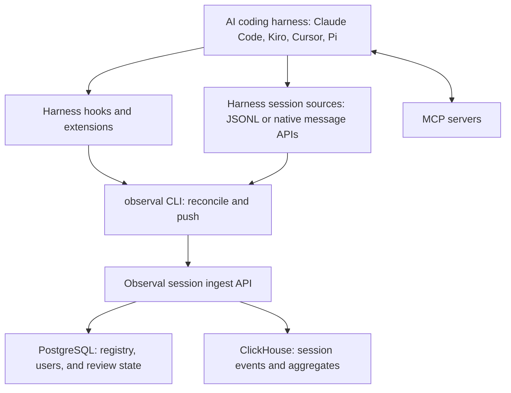

<!-- SPDX-FileCopyrightText: 2026 Apoorv Garg <apoorvgarg.21@gmail.com> -->
<!-- SPDX-FileCopyrightText: 2026 Hari Srinivasan <harisrini21@gmail.com> -->
<!-- SPDX-License-Identifier: Apache-2.0 -->

# Core Concepts

The vocabulary you need to be productive with Observal. Read once; every other page in these docs assumes you know these terms.

## The big picture



Observal reads harness session transcripts or native message APIs. Hooks and extensions wake the exporter during the session, while `observal reconcile` recovers records that were not delivered during the original hook run. MCP commands and remote URLs remain direct.

Two data stores, two concerns:

* **Postgres** holds the *registry*: users, accounts, agent configs, MCP listings, review state, and alert rules. Transactional, relational.
* **ClickHouse** holds indexed session events, session aggregates, audit events, and security events. High-volume, time-series, fast analytical queries.

## The registry

Six component types. Agents bundle the other five.

| Type | What it is |
| --- | --- |
| **Agent** | A complete, installable AI agent. Bundles MCP servers, skills, hooks, prompts, and sandboxes into one YAML. |
| **MCP Server** | A [Model Context Protocol](https://modelcontextprotocol.io/) server, the tools an agent can call. |
| **Skill** | A portable instruction package agents load on demand. |
| **Hook** | A lifecycle callback that runs on session start, tool use, session end, etc. |
| **Prompt** | A named, parameterized prompt template with variable substitution. |
| **Sandbox** | A Docker execution environment for running code the agent generates. |

Anyone can publish. Admin review controls what appears in the public listing, but your own items are usable immediately without approval.

## Telemetry: sessions and events

### Session

A harness conversation or task identified by `session_id`. Observal stores each source record with its harness, user, agent attribution, and source offset.

### Event

A parsed record inside a session, such as a user prompt, assistant response, tool call, tool result, token update, lifecycle hook, or subagent event. The exact event detail depends on what the harness records in its transcript.

### Aggregate

`session_stats_agg` summarizes event counts, prompts, tool calls, tool results, token totals, model names, harnesses, and session timing. Dashboards and insights derive adoption and usage metrics from these session aggregates.

## Durable session outboxes

Session traces use **eventual at-least-once delivery with effectively-once storage**. Python exporters persist records in `~/.observal/telemetry_buffer.db` before upload. OpenCode and Pi use native durable outboxes under `~/.observal/`. Failed attempts remain pending across process restarts. A batch is removed, and its source line advances, only after the server acknowledges a contiguous checkpoint that covers it.

The server identifies a source record by project, user, harness, session ID, and source line index. Retries and overlapping batches therefore converge to one canonical record. If local cursor state is missing, corrupt, or stale, recovery reads the authenticated server checkpoint before resuming. Finalization performs a stable-file pass and SHA-256 audit; a mismatch rewinds to the affected range for idempotent replay. Full-history hashing does not run on normal hook uploads.

The guarantee begins when Observal observes and durably spools a record. It cannot recover a source record that the harness deletes before any installed hook or extension runs.

Check Python exporter outbox status:

```bash
observal auth status
observal ops telemetry status
```

Drain happens automatically on the next exporter wake-up after the server is reachable.

## Deployment mode

SSO-only access is controlled by `deployment.sso_only`:

| Mode | Self-registration | Bootstrap | Auth |
| --- | --- | --- | --- |
| `deployment.sso_only=false` (default) | Yes | Yes (fresh server creates admin on first login) | Email + password or API key |
| `deployment.sso_only=true` | No | No | SSO only |

You pick this when you set up the server. Most self-hosters use `deployment.sso_only=false`.

## Next

→ [Use Cases](../use-cases/README.md) to see what you can actually do with all of this.
