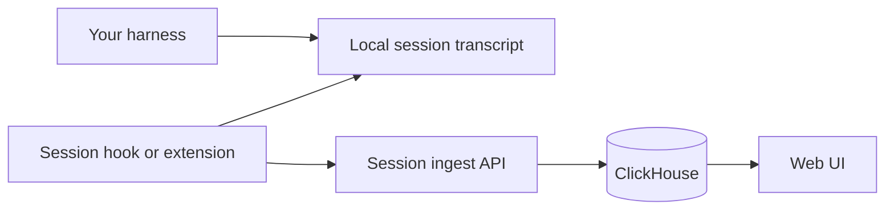

<!-- SPDX-FileCopyrightText: 2026 Apoorv Garg <apoorvgarg.21@gmail.com> -->
<!-- SPDX-FileCopyrightText: 2026 Hari Srinivasan <harisrini21@gmail.com> -->
<!-- SPDX-FileCopyrightText: 2026 Lokesh Selvam <lokeshselvam7025@gmail.com> -->
<!-- SPDX-FileCopyrightText: 2026 Shaan Narendran <shaannaren06@gmail.com> -->
<!-- SPDX-FileCopyrightText: 2026 tsitu0 <tomsitu0102@gmail.com> -->
<!-- SPDX-License-Identifier: Apache-2.0 -->

# Quickstart

Go from zero to "my first trace in the Observal dashboard" in about five minutes. This assumes you have Docker running.

By the end of this guide you will have:

* The Observal CLI installed
* An Observal server running locally
* The CLI logged in as an admin
* At least one MCP server instrumented
* A live trace visible in the web UI

## 1. Install the CLI

```bash
curl -fsSL https://raw.githubusercontent.com/Observal/Observal/main/install.sh | bash
```

No Python required. For alternative install methods, see [Installation](../).

> \[!NOTE] You need Docker Engine ≥ 24.0 with Compose v2 (`docker compose`, not `docker-compose`). Homebrew's Docker formula is outdated. Install [Docker Desktop](https://docs.docker.com/get-docker/) or use your distro's upstream packages. Verify with `docker version` and `docker compose version`.

## 2. Start the server

```bash
git clone https://github.com/Observal/Observal.git
cd Observal
cp .env.example .env

docker compose -f docker/docker-compose.yml up --build -d
```

That's it. The `.env.example` ships with working defaults. The core services come up:

| Service               | URL                     | Purpose                        |
| --------------------- | ----------------------- | ------------------------------ |
| `observal-lb` (nginx) | `http://localhost`      | Reverse proxy (API + Web)      |
| `observal-web`        | `http://localhost:3000` | Web UI (Next.js, direct)       |
| `observal-api`        | internal                | FastAPI backend                |
| `observal-worker`     | internal                | Background jobs (arq)          |
| `observal-init`       | internal                | Runs DB migrations, then exits |
| `observal-db`         | `localhost:5432`        | PostgreSQL 16                  |
| `observal-clickhouse` | `localhost:8123`        | ClickHouse                     |
| `observal-redis`      | `localhost:6379`        | Redis                          |

Optional monitoring can be enabled with `make up-prometheus` or `make up-observability`. Prometheus listens on `http://localhost:9090`; Grafana listens on `http://localhost:3001` when the Grafana profile is enabled.

The API waits for Postgres, ClickHouse, and Redis to pass health checks before starting. Expect 15–30 seconds. Confirm it is up:

```bash
curl http://localhost/health
# → {"status": "ok"}
```

Hitting a port conflict? See [Self-Hosting → Ports and volumes](../self-hosting/ports-and-volumes.md).

## 3. Log in

```bash
observal auth login
```

Prompts:

1. **Server URL**: press Enter for `http://localhost`
2. **Login method**: pick `[E]mail`
3. **Email / password**: use one of the seeded demo accounts:

| Role        | Email                   | Password            |
| ----------- | ----------------------- | ------------------- |
| Super Admin | `super@demo.example`    | `super-changeme`    |
| Admin       | `admin@demo.example`    | `admin-changeme`    |
| Reviewer    | `reviewer@demo.example` | `reviewer-changeme` |
| User        | `user@demo.example`     | `user-changeme`     |

Log in as super admin for the fewest restrictions while exploring. Credentials land in `~/.observal/config.json` (mode `0600`).

Check it worked:

```bash
observal auth whoami
# → super@demo.example (super_admin)
```

## 4. Discover and instrument your harness

If you already have MCP servers configured in Claude Code, Kiro, Cursor, VS Code, or Copilot, first see what's there:

```bash
observal scan
```

Expected output lists detected harnesses, MCP servers, skills, hooks, and agents. MCP commands and remote URLs are shown exactly as configured.

`scan` is read-only: it shows what you have without modifying anything. Install session telemetry hooks:

```bash
observal doctor patch --all-harnesses
```

`doctor patch` installs supported session hooks and extensions. It does not rewrite MCP configuration. Restart your harness so the hook changes take effect, then begin a coding session.

## 5. See your first trace

Open `http://localhost/traces` in your browser. Start a prompt in your harness and let the session complete. Refresh to see the indexed session and its parsed events.

Or use the CLI:

```bash
observal ops traces --limit 5
```

## 6. (Optional) Pull an agent

Browse what the community has published:

```bash
observal agent list
observal agent show <agent-name>
```

Install one into your harness:

```bash
observal agent pull <agent-name> --harness <harness-name>
```

This writes agent files, skills, hooks, and direct MCP configs into the right places for your harness.

## What you just built



Observal indexes session transcript records into canonical events and aggregates.

## Where to next

| You want to...                      | Go to                             |
| ----------------------------------- | --------------------------------- |
| Understand registry identity        | [Core concepts](../core-concepts/) |
| Understand session tracking         | [Session tracking and reconciliation](../core-concepts/session-tracking.md) |
| Learn what to do with traces        | [Use Cases](../use-cases/)        |
| Configure the server for production | [Self-Hosting](../self-hosting/)  |
| Deep-dive on a CLI command          | [CLI Reference](../cli/)          |
