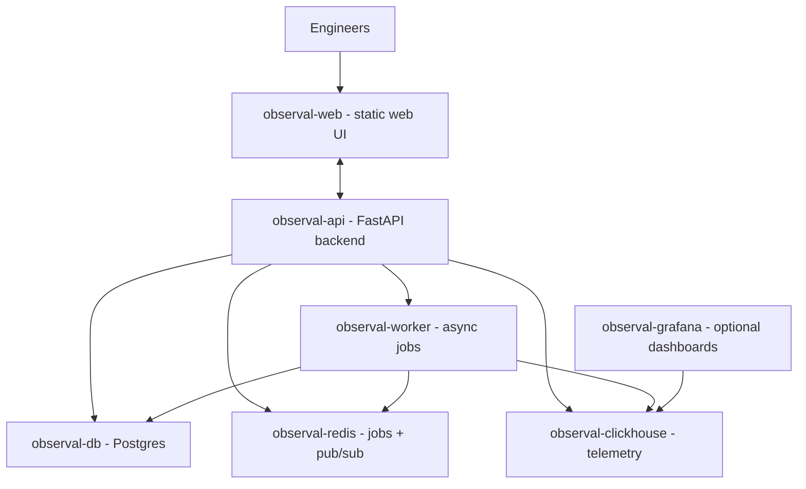

<!-- SPDX-FileCopyrightText: 2026 Apoorv Garg <apoorvgarg.21@gmail.com> -->
<!-- SPDX-FileCopyrightText: 2026 Hari Srinivasan <harisrini21@gmail.com> -->
<!-- SPDX-FileCopyrightText: 2026 Lokesh Selvam <lokeshselvam7025@gmail.com> -->
<!-- SPDX-License-Identifier: Apache-2.0 -->

# Overview

Run Observal entirely on your own infrastructure. No SaaS, no egress, every byte of telemetry stays inside your network.

## Architecture at a glance

**Seven services:**

| Service               | Image                               | Ports      | Purpose                   |
| --------------------- | ----------------------------------- | ---------- | ------------------------- |
| `observal-api`        | built from `docker/Dockerfile.api`  | 8000       | FastAPI backend           |
| `observal-web`        | built from `docker/Dockerfile.web`  | 3000       | Next.js web UI            |
| `observal-db`         | `postgres:16`                       | 5432       | Registry, users, config   |
| `observal-clickhouse` | `clickhouse/clickhouse-server:26.3` | 8123       | Session and audit events |
| `observal-redis`      | `redis:7-alpine`                    | 6379       | Job queue (arq) + pub/sub |
| `observal-worker`     | built from `docker/Dockerfile.api`  | (internal) | Background async jobs     |
| `observal-grafana`    | `grafana/grafana-oss:11.6.5`        | 3001       | Dashboards (optional)     |

All services run on a private `observal-net` bridge network. Named volumes (`pgdata`, `chdata`, `redisdata`, `grafanadata`, `apidata`) hold persistent data.

## Deployment tiers

Choose the deployment model that fits your team:

|                    | [Single-node](single-node-deploy.md) | [Kubernetes](https://github.com/Observal/Observal/blob/main/docs/self-hosting/kubernetes-helm.md) | [Production](production-deploy.md)    |
| ------------------ | ------------------------------------ | --------------------------------------------------------------------------------------------------- | ------------------------------------- |
| **How**            | Docker Compose on one VM             | Official Helm chart                                                                                 | Terraform on AWS or GCP               |
| **Best for**       | ≤50 users, internal tools, POCs      | Cloud-native teams, existing K8s infra                                                              | Enterprise, SLA-bound, 50+ users      |
| **Cost**           | $20 to $150/mo                       | Variable                                                                                            | \~$180 to $255/mo                     |
| **HA**             | No                                   | Pod resilience & horizontal scaling                                                                 | Yes (Multi-AZ databases, autoscaling) |
| **Time to deploy** | 10 minutes                           | 10 to 15 minutes                                                                                    | 20 to 30 minutes                      |

**Start here:**

| If you want to...                | Read                                                                                                                     |
| -------------------------------- | ------------------------------------------------------------------------------------------------------------------------ |
| Deploy on a single VM (simplest) | [Single-node deployment](single-node-deploy.md)                                                                          |
| Deploy on Kubernetes with Helm   | [Kubernetes deployment with Helm](https://github.com/Observal/Observal/blob/main/docs/self-hosting/kubernetes-helm.md) |
| Deploy a production HA stack     | [Production deployment](production-deploy.md)                                                                            |
| Deploy on AWS specifically       | [AWS deployment with Terraform](aws-terraform.md)                                                                        |
| Deploy on GCP specifically       | [GCP deployment with Terraform](gcp-terraform.md)                                                                        |

**Then configure and operate:**

| If you want to...                     | Read                                        |
| ------------------------------------- | ------------------------------------------- |
| Confirm your machine can run Observal | [Requirements](requirements.md)             |
| Get the stack running locally for dev | [Docker Compose setup](docker-compose.md)   |
| Know every env var that matters       | [Configuration](configuration.md)           |
| See every port and volume at a glance | [Ports and volumes](ports-and-volumes.md)   |
| Understand the DBs and retention      | [Databases](databases.md)                   |
| Set up SSO, JWT keys, demo accounts   | [Authentication and SSO](authentication.md) |
| Understand the telemetry pipeline     | [Telemetry pipeline](telemetry-pipeline.md) |
| Upgrade safely                        | [Upgrades](upgrades.md)                     |
| Back up and restore                   | [Backup and restore](backup-and-restore.md) |
| Fix something that's broken           | [Troubleshooting](troubleshooting.md)       |

## Production checklist

Before putting Observal in front of real users:

1. **Generate a real `SECRET_KEY`**: `python3 -c "import secrets; print(secrets.token_urlsafe(32))"`.
2. **Set strong Postgres and ClickHouse passwords**: not the `.env.example` defaults.
3. **Scope `CORS_ALLOWED_ORIGINS`** to your real frontend host.
4. **Configure SSO** in **Admin → SSO**, including `deployment.sso_only` if you want SSO-only login.
5. **Tune rate limits** (`RATE_LIMIT_AUTH`, `RATE_LIMIT_AUTH_STRICT`).
6. **Set `DATA_RETENTION_DAYS`** to match your retention policy (default 90 days).
7. **Back up the JWT key volume** (`apidata`): losing it invalidates every session.
8. **Remove demo accounts**: unset `DEMO_*` env vars before the first startup in a real environment.

Each of these is covered in the linked deep-dive below. Start with [Requirements](requirements.md).
