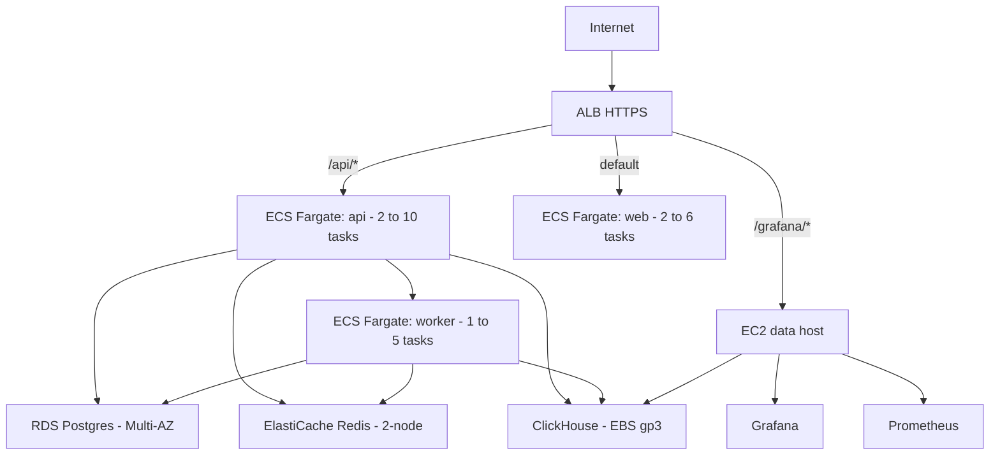
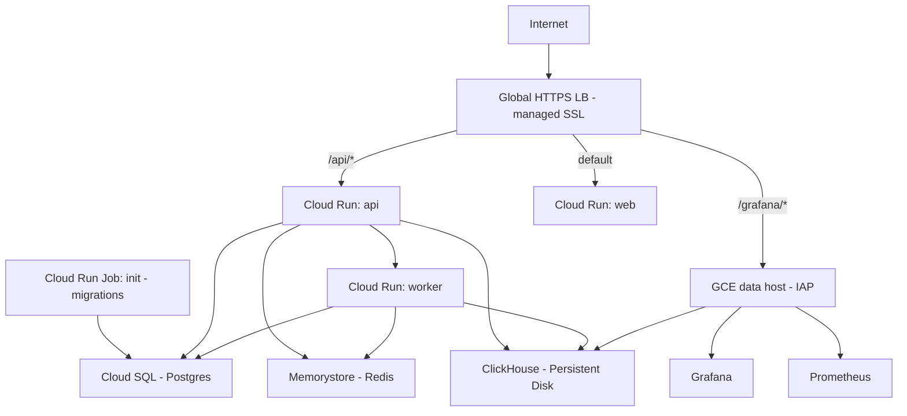

<!-- SPDX-FileCopyrightText: 2026 Lokesh Selvam <lokeshselvam7025@gmail.com> -->
<!-- SPDX-License-Identifier: Apache-2.0 -->

# Production deployment

Deploy Observal as a distributed, highly-available stack on AWS or GCP using Terraform. Best for enterprise customers, SLA-bound deployments, teams over 50 users, and any environment where uptime and horizontal scaling matter.

**End state:** a fully managed Observal install with autoscaling compute, managed databases with automated failover, encrypted secrets, centralized logging, automated backups, and HTTPS on your domain — provisioned with a single `terraform apply`.

## When to use this vs. single-node

| | [Single-node](single-node-deploy.md) | Production (this guide) |
|---|---|---|
| **Best for** | Small/mid teams, internal use, POCs | Enterprise, SLA-bound, high-traffic |
| **Infra** | 1 VM, any cloud or on-prem | ~100 managed cloud resources |
| **Cost** | $20–150/mo | ~$255/mo (AWS) |
| **HA** | No — single point of failure | Yes — Multi-AZ databases, autoscaling compute |
| **Failover** | Manual (reboot / redeploy) | Automatic (managed services handle it) |
| **Scaling** | Vertical (bigger VM) | Horizontal (add more containers) |
| **Backups** | Cron + S3 | Automated (RDS snapshots, systemd timers, S3 lifecycle) |
| **Secrets** | `.env` file on disk | SSM Parameter Store / Secret Manager (encrypted, auditable) |
| **Logging** | `docker compose logs` | CloudWatch / Cloud Logging (centralized, retained, searchable) |
| **Time to deploy** | 10 minutes | 20–30 minutes |

## Choose your cloud

Observal ships Terraform modules for both AWS and GCP. They provision equivalent architectures using each cloud's native managed services.

### AWS



| Component | AWS Service | Notes |
|---|---|---|
| Compute (stateless) | ECS Fargate | api, web, worker as separate services |
| Postgres | RDS Postgres 16 | Multi-AZ on prod, encrypted, automated backups |
| Redis | ElastiCache Redis 7 | 2-node replication, automatic failover on prod |
| ClickHouse | EC2 + EBS gp3 | Self-hosted; option to use ClickHouse Cloud |
| Load balancer | ALB | HTTPS via ACM, path-based routing |
| Secrets | SSM Parameter Store | Encrypted with KMS, injected into ECS tasks |
| Logging | CloudWatch | Per-service log groups |
| Backups | S3 + RDS snapshots | Lifecycle: Standard → IA → Glacier → expire |
| DNS | Route 53 | Optional; works without a custom domain |

**Full walkthrough:** [AWS deployment with Terraform](aws-terraform.md)

**Quick start:**

```bash
git clone https://github.com/Observal/Observal.git
cd Observal/infra/terraform/aws

# Configure
cp terraform.tfvars.example terraform.tfvars
# Edit: region, environment, domain_name (optional), alb_ingress_cidrs

# Deploy
terraform init
terraform plan -out tf.plan
terraform apply tf.plan

# Verify
terraform output app_url
curl -fsS "$(terraform output -raw app_url)/readyz"
```

Apply takes ~20–30 minutes (RDS Multi-AZ provisioning dominates). Baseline cost: **~$255/mo** in us-east-1.

### GCP



| Component | GCP Service | Notes |
|---|---|---|
| Compute (stateless) | Cloud Run v2 | api, web, worker as separate services |
| Migrations | Cloud Run Jobs | One-shot init task |
| Postgres | Cloud SQL | HA configuration available |
| Redis | Memorystore | Managed Redis |
| ClickHouse | GCE instance | Docker Compose on a single VM; option for ClickHouse Cloud |
| Load balancer | Global HTTPS LB | Managed SSL certificate |
| Secrets | Secret Manager | Injected into Cloud Run at start |
| Logging | Cloud Logging | Built-in, no config needed |
| Backups | GCS | Versioned bucket with lifecycle |
| DNS | Cloud DNS | Optional |
| Shell access | IAP SSH tunnel | No public SSH, no SSH keys |

**Full walkthrough:** [GCP deployment with Terraform](gcp-terraform.md)

**Quick start:**

```bash
cd Observal/infra/terraform/gcp

# Enable required APIs
gcloud services enable \
  run.googleapis.com sqladmin.googleapis.com redis.googleapis.com \
  compute.googleapis.com secretmanager.googleapis.com \
  dns.googleapis.com vpcaccess.googleapis.com \
  servicenetworking.googleapis.com

# Configure
cp terraform.tfvars.example terraform.tfvars
# Edit: project_id, region, domain_name (optional)

# Deploy
terraform init
terraform plan -out tf.plan
terraform apply tf.plan

# Run migrations
gcloud run jobs execute observal-prod-init --region=us-central1

# Verify
terraform output app_url
```


## Day-2 operations

These apply to both AWS and GCP. Cloud-specific commands are in the respective guides.

### Upgrade to a new release

```hcl
# terraform.tfvars
image_tag = "v1.5.0"
```

```bash
terraform apply
```

The init task re-runs migrations. Compute services roll over with zero downtime.

### Roll back

Set `image_tag` to the previous version and `terraform apply`. Database data is not affected. If the failed version ran a destructive migration (rare, always called out in the CHANGELOG), restore from the pre-upgrade database backup.

### Scale up

Adjust variables in `terraform.tfvars`:

```hcl
# More API containers
api_desired_count  = 4
api_autoscale_max  = 20

# Bigger database
db_instance_class  = "db.m6g.large"      # AWS
# postgres_tier    = "db-custom-4-16384"  # GCP

# Bigger ClickHouse host
data_instance_type = "m6i.xlarge"        # AWS
# data_machine_type = "e2-standard-4"    # GCP
```

```bash
terraform apply
```

### ClickHouse Cloud (for HA)

The self-hosted ClickHouse is a single instance. For real high availability:

```hcl
clickhouse_mode           = "cloud"
clickhouse_cloud_url      = "https://abc123.us-east-1.aws.clickhouse.cloud:8443"
clickhouse_cloud_password = "..."
```

The EC2/GCE data host is skipped entirely. You become responsible for Grafana hosting (AWS Managed Grafana or a separate Cloud Run service).

### Tear down

```bash
terraform destroy
```

On prod, databases have deletion protection enabled. Disable manually before destroy if you really mean it.

## Cost comparison

### AWS (us-east-1, on-demand)

| Component | Spec | ~$/month |
|---|---|---|
| Fargate api 2× | 0.5 vCPU / 1 GB | $30 |
| Fargate web 2× | 0.25 vCPU / 0.5 GB | $15 |
| Fargate worker 1× | 0.5 vCPU / 1 GB | $15 |
| EC2 data host | t3.large | $60 |
| RDS Postgres Multi-AZ | db.t4g.small | $50 |
| ElastiCache Redis 2× | cache.t4g.micro | $25 |
| ALB | — | $20 |
| NAT Gateway | — | $33 + egress |
| EBS gp3 100 GB | — | $8 |
| S3 backups | ~1 GB cold | $0.10 |
| **Total** | | **~$255** |

Set `environment = "staging"` to halve the bill (single-AZ RDS, one Redis node, no deletion protection).

### GCP (us-central1, on-demand)

| Component | Spec | ~$/month |
|---|---|---|
| Cloud Run api | 1 vCPU / 512 MB, min 1 instance | $25 |
| Cloud Run web | 1 vCPU / 256 MB, min 1 instance | $15 |
| Cloud Run worker | 1 vCPU / 512 MB, min 1 instance | $25 |
| Cloud SQL Postgres | db-f1-micro (shared) | $10 |
| Memorystore Redis | 1 GB basic | $35 |
| GCE data host | e2-standard-2 | $50 |
| Global HTTPS LB | — | $18 |
| Persistent Disk 100 GB | — | $4 |
| GCS backups | ~1 GB cold | $0.02 |
| **Total** | | **~$180** |

GCP is typically cheaper due to Cloud Run's per-request billing and no NAT Gateway equivalent charge.

## Production hardening checklist

Applies to both clouds. See the cloud-specific guides for implementation details.

- [ ] Enable remote Terraform state (S3 + DynamoDB on AWS, GCS on GCP)
- [ ] Restrict load balancer ingress to known CIDRs
- [ ] Enable cloud security services (GuardDuty + Config on AWS, Security Command Center on GCP)
- [ ] Set up alerting on database CPU, memory, and 5xx error rates
- [ ] Attach a WAF to the load balancer
- [ ] Enable Redis transit encryption
- [ ] Configure [SSO](authentication.md) (SAML or OIDC)
- [ ] Move ClickHouse to ClickHouse Cloud for HA
- [ ] Test the [backup and restore](backup-and-restore.md) procedure end-to-end
- [ ] Replace the GitHub tarball pull in the data host bootstrap with an artifact you control

## Next

- [AWS deployment with Terraform](aws-terraform.md) — full AWS walkthrough
- [GCP deployment with Terraform](gcp-terraform.md) — full GCP walkthrough
- [Configuration](configuration.md) — environment variables reference
- [Upgrades](upgrades.md) — upgrade and rollback procedures
- [Backup and restore](backup-and-restore.md) — detailed restore procedures
