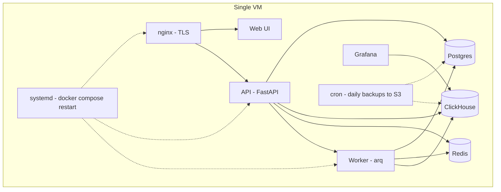

<!-- SPDX-FileCopyrightText: 2026 Lokesh Selvam <lokeshselvam7025@gmail.com> -->
<!-- SPDX-License-Identifier: Apache-2.0 -->

# Single-node deployment

Run the full Observal stack on a single VM with Docker Compose. Best for teams of up to ~50 users, internal tools, evaluations, and any deployment where simplicity matters more than multi-AZ redundancy.

**End state:** Observal running behind TLS on one server, with automated backups to S3-compatible storage, surviving reboots, and upgradable in under a minute.

## When to use this vs. the Terraform module

| | Single-node (this guide) | [Production Terraform](aws-terraform.md) |
|---|---|---|
| **Best for** | Small/mid teams, internal use, POCs | Enterprise, SLA-bound, high-traffic |
| **Infra** | 1 VM, any cloud or on-prem | ~100 managed AWS resources |
| **Cost** | $20–150/mo | ~$255/mo |
| **HA** | No — single point of failure | Yes — Multi-AZ Postgres, autoscaling ECS |
| **Time to deploy** | 10 minutes | 20–30 minutes |
| **Operational complexity** | Low — SSH, docker compose, cron | Medium — Terraform, AWS console, CloudWatch |
| **Scaling** | Vertical (bigger VM) | Horizontal (more Fargate tasks) |

## Architecture



Everything runs as Docker containers on a single host. The nginx LB routes traffic and terminates TLS. Docker's restart policy and systemd keep the stack running across reboots.

## Prerequisites

| Requirement | Minimum | Recommended |
|---|---|---|
| **VM** | 2 vCPU, 4 GB RAM, 40 GB SSD | 4 vCPU, 8 GB RAM, 100 GB SSD |
| **OS** | Ubuntu 22.04+ / Amazon Linux 2023 / Debian 12 | Ubuntu 24.04 LTS |
| **Docker** | Engine ≥ 24.0 with Compose v2 | Latest stable |
| **Domain** (for TLS) | A DNS record pointing to the VM's public IP | — |
| **Firewall** | Ports 80, 443 open inbound | — |

### Sizing guide

| Team size | VM spec | Estimated cost (AWS) |
|---|---|---|
| 1–10 users | `t3.medium` (2 vCPU / 4 GB) | ~$30/mo |
| 10–30 users | `t3.large` (2 vCPU / 8 GB) | ~$60/mo |
| 30–50 users | `t3.xlarge` (4 vCPU / 16 GB) | ~$120/mo |
| 50+ users | Consider the [Terraform module](aws-terraform.md) | ~$255/mo |

ClickHouse is the memory consumer. If you run out, increase `CLICKHOUSE_MEMORY_LIMIT` before resizing the VM.

## Step 1: Provision the VM

Use any cloud provider or on-prem hypervisor. Example for AWS:

```bash
aws ec2 run-instances \
  --image-id ami-0c7217cdde317cfec \
  --instance-type t3.large \
  --key-name your-key \
  --security-group-ids sg-xxxxx \
  --block-device-mappings '[{"DeviceName":"/dev/sda1","Ebs":{"VolumeSize":100,"VolumeType":"gp3"}}]' \
  --tag-specifications 'ResourceType=instance,Tags=[{Key=Name,Value=observal}]'
```

For other clouds:
- **GCP:** `e2-standard-2` with 100 GB balanced persistent disk
- **Azure:** `Standard_B2ms` with 100 GB Premium SSD
- **Hetzner:** `CPX31` (4 vCPU / 8 GB, ~€15/mo)
- **On-prem:** any Linux box meeting the specs above

## Step 2: Install Docker

SSH into the VM and install Docker:

```bash
ssh ubuntu@your-server-ip

# Ubuntu / Debian
curl -fsSL https://get.docker.com | sh
sudo usermod -aG docker $USER
newgrp docker

# Verify
docker version
docker compose version
```

## Step 3: Clone and configure

```bash
git clone https://github.com/Observal/Observal.git
cd Observal
cp .env.example .env
```

Edit `.env` for production. At minimum, change these:

```bash
# Generate a secure secret key
SECRET_KEY=$(python3 -c "import secrets; print(secrets.token_urlsafe(32))")

# Set strong database passwords
POSTGRES_PASSWORD=$(openssl rand -base64 24)
CLICKHOUSE_PASSWORD=$(openssl rand -base64 24)

# Set your domain (used for CORS and OAuth redirects)
CORS_ALLOWED_ORIGINS=https://observal.yourcompany.com
FRONTEND_URL=https://observal.yourcompany.com

# Remove demo accounts for production
# Comment out or delete all DEMO_* variables
```

Write them into `.env`:

```bash
sed -i "s|^SECRET_KEY=.*|SECRET_KEY=$SECRET_KEY|" .env
sed -i "s|^POSTGRES_PASSWORD=.*|POSTGRES_PASSWORD=$POSTGRES_PASSWORD|" .env
sed -i "s|^CLICKHOUSE_PASSWORD=.*|CLICKHOUSE_PASSWORD=$CLICKHOUSE_PASSWORD|" .env
```

> SAML SSO, audit logs, and executive dashboards are included in the open-source distribution. See [Configuration](configuration.md).

## Step 4: Set up TLS

### Option A: Caddy (simplest — automatic HTTPS)

```bash
sudo apt install -y caddy
```

Create `/etc/caddy/Caddyfile`:

```caddyfile
observal.yourcompany.com {
    reverse_proxy localhost:80
}
```

```bash
sudo systemctl enable --now caddy
```

Caddy handles Let's Encrypt certificates automatically. No renewal cron needed.

### Option B: Certbot + nginx production config

```bash
sudo apt install -y certbot
sudo certbot certonly --standalone -d observal.yourcompany.com
```

Then use the production compose overlay which configures nginx for TLS:

```bash
cd docker
docker compose -f docker-compose.yml -f docker-compose.production.yml up -d
```

Set up auto-renewal:

```bash
echo "0 3 * * * certbot renew --quiet && docker compose -f /home/ubuntu/Observal/docker/docker-compose.yml -f /home/ubuntu/Observal/docker/docker-compose.production.yml restart observal-lb" | sudo tee -a /etc/crontab
```

### Option C: Behind a cloud load balancer

If your VM sits behind an AWS ALB, GCP HTTPS LB, or Cloudflare, terminate TLS there and proxy to port 80 on the VM. No TLS config on the VM itself.

## Step 5: Start the stack

```bash
cd ~/Observal
docker compose -f docker/docker-compose.yml up -d --build
```

First build takes 3–5 minutes (pulling images, building the API and web containers). Watch the logs:

```bash
docker compose -f docker/docker-compose.yml logs -f observal-init observal-api
```

Wait for:
```
observal-init  | INFO - Database up to date.
observal-api   | INFO - Application startup complete.
```

Verify:

```bash
curl -fsSL http://localhost/health
# {"status":"ok","initialized":true}
```

## Step 6: Survive reboots

Docker's `restart: unless-stopped` policy (already set in `docker-compose.yml`) handles container restarts. To ensure Docker itself starts on boot:

```bash
sudo systemctl enable docker
```

Test it:

```bash
sudo reboot
# After reconnecting:
docker compose -f ~/Observal/docker/docker-compose.yml ps
# All services should be running
```

## Step 7: Set up automated backups

Create a backup script:

```bash
sudo mkdir -p /opt/observal-backups
cat << 'SCRIPT' | sudo tee /opt/observal-backups/backup.sh
#!/bin/bash
set -euo pipefail

BACKUP_DIR="/opt/observal-backups"
DATE=$(date +%Y%m%d-%H%M)
COMPOSE="docker compose -f /home/ubuntu/Observal/docker/docker-compose.yml"

# Postgres
$COMPOSE exec -T observal-db pg_dump -U postgres observal | gzip > "$BACKUP_DIR/pg-$DATE.sql.gz"

# JWT keys
$COMPOSE exec -T observal-api tar czf - -C /data keys > "$BACKUP_DIR/keys-$DATE.tar.gz"

# Prune backups older than 30 days
find "$BACKUP_DIR" -name "pg-*.sql.gz" -mtime +30 -delete
find "$BACKUP_DIR" -name "keys-*.tar.gz" -mtime +30 -delete

# Upload to S3 (optional — install awscli first)
# aws s3 sync "$BACKUP_DIR" s3://your-backup-bucket/observal/ --exclude "backup.sh"

echo "Backup completed: $DATE"
SCRIPT

sudo chmod +x /opt/observal-backups/backup.sh
```

Schedule it:

```bash
echo "0 3 * * * root /opt/observal-backups/backup.sh >> /var/log/observal-backup.log 2>&1" | sudo tee /etc/cron.d/observal-backup
```

For ClickHouse (weekly, since it's larger):

```bash
echo "0 4 * * 0 root docker compose -f /home/ubuntu/Observal/docker/docker-compose.yml exec -T observal-clickhouse clickhouse-client --password \$CLICKHOUSE_PASSWORD --query \"BACKUP DATABASE observal TO Disk('backups', 'weekly-\$(date +\%Y\%m\%d).zip')\" >> /var/log/observal-backup.log 2>&1" | sudo tee /etc/cron.d/observal-ch-backup
```

See [Backup and restore](backup-and-restore.md) for detailed restore procedures.

## Step 8: First login

Install the CLI on your local machine:

```bash
curl -fsSL https://raw.githubusercontent.com/Observal/Observal/main/install.sh | bash
```

Log in:

```bash
observal auth login
# Server URL: https://observal.yourcompany.com
# Email: (create your admin account or use demo creds if you kept them)
```

Verify:

```bash
observal auth whoami
observal auth status
```

## Upgrades

```bash
cd ~/Observal
git fetch --tags
git checkout v1.5.0    # or whatever version

docker compose -f docker/docker-compose.yml up -d --build
```

Migrations run automatically on API startup. See [Upgrades](upgrades.md) for rollback procedures.

Or use the CLI:

```bash
observal server upgrade --version 1.5.0
```

## Monitoring

Prometheus and Grafana are optional. Start the core stack with Prometheus only:

```bash
docker compose -f docker/docker-compose.yml -f docker/docker-compose.observability.yml up -d
```

Start Prometheus and Grafana:

```bash
COMPOSE_PROFILES=grafana docker compose -f docker/docker-compose.yml -f docker/docker-compose.observability.yml up -d
```

Access Grafana at `http://your-server:3001` when the Grafana profile is enabled.

For basic alerting without Grafana, add a health check cron:

```bash
echo "*/5 * * * * root curl -fsS http://localhost/health > /dev/null || echo 'Observal health check failed' | mail -s 'ALERT: Observal down' ops@yourcompany.com" | sudo tee /etc/cron.d/observal-health
```

## Security hardening

Before exposing to the internet:

- [ ] Remove all `DEMO_*` env vars from `.env`
- [ ] Set a strong `SECRET_KEY`
- [ ] Restrict SSH access (key-only, no password auth)
- [ ] Configure a firewall (`ufw allow 80,443/tcp && ufw enable`)
- [ ] Set up [SSO](authentication.md) if available
- [ ] Enable automatic security updates (`sudo apt install unattended-upgrades`)
- [ ] Bind database ports to localhost only (already done in `docker-compose.yml` via `127.0.0.1:` prefix)

## Scaling up

When you outgrow a single node:

| Symptom | Fix |
|---|---|
| API response times increasing | Increase `API_WORKERS` in `.env` (default 2), or bump to a bigger VM |
| ClickHouse queries slow | Increase `CLICKHOUSE_MEMORY_LIMIT`, move to a bigger VM, or externalize to [ClickHouse Cloud](https://clickhouse.cloud) |
| Disk filling up | Reduce `DATA_RETENTION_DAYS`, add a bigger disk, or move ClickHouse data to a separate volume |
| Need HA / zero downtime deploys | Migrate to the [Terraform module](aws-terraform.md) |

## Next

- [Configuration](configuration.md) — all environment variables
- [Backup and restore](backup-and-restore.md) — detailed restore procedures
- [Upgrades](upgrades.md) — safe upgrade and rollback flow
- [Troubleshooting](troubleshooting.md) — common issues
