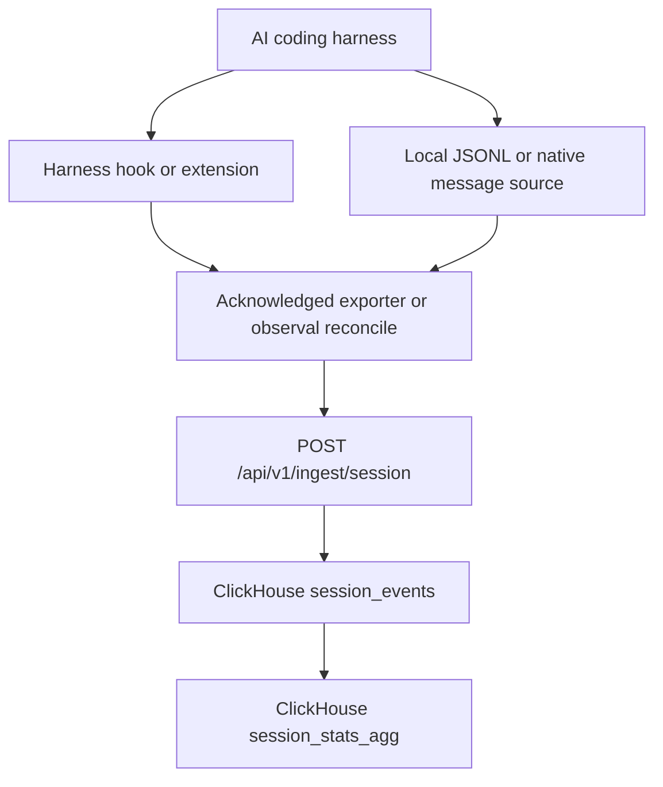

<!-- SPDX-FileCopyrightText: 2026 Apoorv Garg <apoorvgarg.21@gmail.com> -->
<!-- SPDX-FileCopyrightText: 2026 Hari Srinivasan <harisrini21@gmail.com> -->
<!-- SPDX-FileCopyrightText: 2026 tsitu0 <tomsitu0102@gmail.com> -->
<!-- SPDX-License-Identifier: Apache-2.0 -->

# Telemetry pipeline

How local harness session data becomes indexed events and insight-ready aggregates in Observal.

## Session ingestion



MCP commands and remote URLs remain direct. Observal does not intercept MCP transport traffic.

## Source discovery and delivery

Each harness adapter resolves its local session source. Claude Code, Kiro, Codex, Cursor, Copilot, Copilot CLI, and Antigravity use the shared Python exporter. OpenCode and Pi implement the same ingest contract through native extensions.

Observed records are staged in a durable local outbox before upload. The source cursor advances only after the server acknowledges a contiguous checkpoint. Retries and overlapping batches converge because records are identified by project, user, harness, session, and source offset.

Hooks wake the exporter at lifecycle boundaries such as prompt submission and session stop. `observal reconcile` uses the same adapters and delivery engine to recover sessions that were missed or only partially delivered.

## Server processing

The ingest service stores source records in `session_events` and classifies them through the parser registered for the harness. Parsed event types include prompts, assistant responses, tool calls, tool results, token updates, lifecycle events, and subagent activity when the harness records them.

`session_stats_agg` stores session-level counts, timing, token totals, model names, harnesses, users, and agent attribution. Dashboards and insights query these session tables rather than a separate trace or span store.

## Installation

`observal agent pull` installs agent files and harness-specific session hooks. To install or repair hooks without pulling an agent:

```bash
observal doctor patch --all-harnesses
```

The patch command does not modify MCP configuration.

## Verification

```bash
observal auth status
observal ops telemetry status
observal reconcile --dry-run
observal ops traces --limit 5
```

If records are missing, confirm the harness source exists, the hook or extension is installed, and the local outbox can reach the session ingest endpoint.
