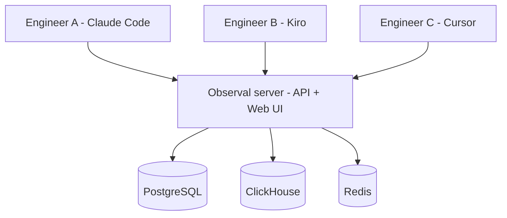

<!-- SPDX-FileCopyrightText: 2026 Apoorv Garg <apoorvgarg.21@gmail.com> -->
<!-- SPDX-FileCopyrightText: 2026 Hari Srinivasan <harisrini21@gmail.com> -->
<!-- SPDX-FileCopyrightText: 2026 Shaan Narendran <shaannaren06@gmail.com> -->
<!-- SPDX-FileCopyrightText: 2026 tsitu0 <tomsitu0102@gmail.com> -->
<!-- SPDX-License-Identifier: AGPL-3.0-only -->

# Run a team-wide agent registry

Once two or more people are authoring agents, you need a single source of truth. Observal becomes your team's internal Docker Hub for AI agents, with review, RBAC, and telemetry baked in.

## What changes at team scale

* **Discovery**: everyone sees the same list of agents, MCPs, skills, hooks, prompts, and sandboxes.
* **Review**: admins approve what appears in the public listing. Authors' own items are still immediately usable.
* **Governance**: RBAC roles (`super_admin`, `admin`, `reviewer`, `user`) control who can publish and approve.
* **Visibility**: centralized dashboards instead of "ask Sarah which version she's running."

## Setup shape

Deploy once, everyone points at it.



Install the server once ([Self-Hosting](../self-hosting/README.md)). Then every engineer installs the CLI and runs `observal auth login` pointed at your shared server URL.

## Users and roles

Four roles, RBAC-enforced on every endpoint.

| Role | Can | Cannot |
| --- | --- | --- |
| `user` | Publish components (subject to review), install agents, view their own traces | Approve submissions, see other users' private traces, change server settings |
| `reviewer` | Everything `user` can + approve/reject submissions | Change server settings, manage users |
| `admin` | Everything `reviewer` can + manage users, change server settings | Only restriction: certain super-admin operations |
| `super_admin` | Everything | - |

Manage users:

```bash
observal admin users
observal admin reset-password <email>          # interactive or --generate
observal admin delete-user <email>
```

Change a role via the web UI (`/settings/users`) or the API (`PUT /api/v1/admin/users/{id}/role`).

## Onboarding a new engineer

Two commands to get them productive:

```bash
# The new engineer runs:
curl -fsSL https://raw.githubusercontent.com/BlazeUp-AI/Observal/main/install.sh | bash
observal auth login --server https://observal.your-company.internal
```

For managed deployments, users authenticate through SSO or are provisioned by an admin. See [Authentication and SSO](../self-hosting/authentication.md).

After logging in, they can:

```bash
observal agent list                           # see every agent the team has published
observal agent pull team-reviewer --harness claude-code # install one
observal scan                                 # discover what they have installed
observal doctor patch --all --all-harnesses        # instrument everything
```

## Review workflow

Authors submit. Reviewers approve. Approved items appear in the public listing.

```bash
observal admin review list                    # pending submissions
observal admin review show <id>
observal admin review approve <id>
observal admin review reject <id> --reason "missing env var docs"
```

What reviewers look for:

* Does the README/description make it clear what the component does?
* Does the MCP analysis (from `submit`) look correct: tools, env vars, transport?
* Are required env vars documented?
* Is the repo URL trustworthy (pinned commit or tag)?

Everything published is visible to the author immediately. Review controls what appears in the public listing.

## Telemetry across the whole team

Because every engineer's shim streams into the same server, `observal ops` becomes a team dashboard:

```bash
observal ops top --type agent           # most-used agents across the team
observal ops top --type mcp             # hottest MCP servers
```

Filters in the web UI let you slice by user, agent, harness, and time range.

## Enterprise concerns

For orgs that need SSO and audit logging, enable enterprise mode:

```
DEPLOYMENT_MODE=enterprise
OAUTH_CLIENT_ID=...
OAUTH_CLIENT_SECRET=...
OAUTH_SERVER_METADATA_URL=...
```

See [Authentication and SSO](../self-hosting/authentication.md).

## Next

→ [Self-Hosting](../self-hosting/README.md): the operator's playbook for actually running the server this use case depends on.
